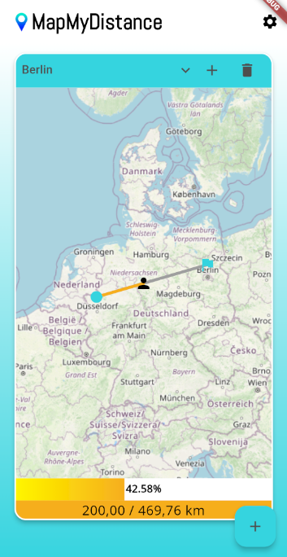

# MapMyDistance  

**MapMyDistance** is a mobile app designed to make reaching your distance fitness goals engaging and visual. Whether you're running, cycling, or walking, track your progress toward a destination goal on an interactive map.  

## Features  

- **Set Your Goal**: Add a start and end point for your journey.  
- **Track Your Progress**: Log your activities (in kilometers or miles), and watch as your progress updates in real-time on the map.  
- **Interactive Map**: Visualize your journey with a user icon moving closer to your destination after each activity.  
- **Multilanguage Support**: Available in **English** and **German**.  
- **Themes**: Choose between **light** and **dark** mode to match your preferences.  

## How It Works  

1. **Set Up a Goal**:  
   - Select your starting point and destination.  
   - The app will calculate the distance between those.  

2. **Log Your Activities**:  
   - After a run, bike ride, or walk, enter the distance covered.  
   - Your progress is updated, and the user icon moves closer to the goal.  

3. **Track Your Journey**:  
   - View your progress visually on the map.  
   - Stay motivated by seeing how close you are to your destination.

## Technologies Used  

- **Framework**: Built using Flutter.  
- **Mapping**: Powered by Leaflet & OpenStreetMap.  

## Screenshots  


| Light Theme | Dark Theme |
|-------------|------------|
|  |  |

## Installation  

1. Clone the repository:  
   ```bash  
   git clone https://github.com/kyralux/MapMyDistance.git  
   ```  

2. Navigate to the project directory:  
   ```bash  
   cd MapMyDistance  
   ```  

3. Install dependencies:  
   ```bash  
   flutter pub get  
   ```  

4. Run the app:  
   ```bash  
   flutter run  
   ```  

## Languages  

- **English**  
- **German** 
